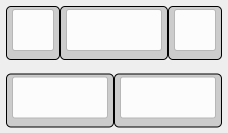
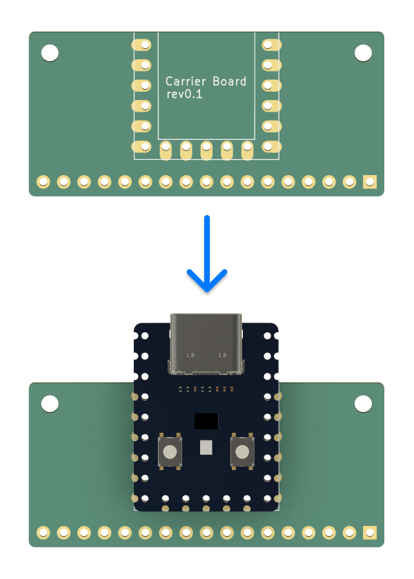
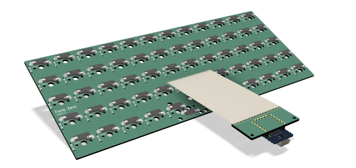
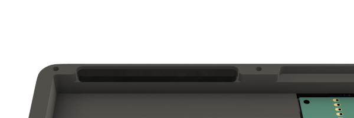
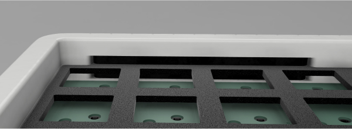

# Build Guide
Please open an issue if you have any questions.

# The parts
I've included links to purchase some of the parts needed for this build. They're all non-affiliate links.

- [3D printed case](cases)
- 1 x RP2040 Zero
- [PCBs](pcbs)
    - There's a main PCB and a carrier board for the RP2040 Zero.
- Flexstrip jumper cables
    - 2.54mm pitch, 80-100mm length.
    - You'll need enough wires to connect the 17 pins on the main PCB and the carrier board.
    - You can find these on farnell or newark (if you're from NA). There's also [an option](https://www.aliexpress.com/item/1005003498734969.html) on aliexpress.
- 10 x M2 heat set inserts
    - [These inserts](https://www.aliexpress.com/item/1005003582355741.html) should work.
    - Select these options: `M2(OD 3.5mm)` and `Length 3mm`.
- 10 x M2x6mm screws
- 58-61 x kailh hotswap sockets
- 60 x 1N4148 diodes
    - The PCB supports both through hole and SMD diodes.
- [Plate](plates)
- Poron gaskets
    - If you want the gaskets to fit the case perfectly, buy these [D65 gaskets](https://www.aliexpress.com/item/1005004488920878.html).
    - Smaller gaskets should also work, as long as they provide enough tension to securely hold the plate in place. **Just make sure the gaskets are 3mm thick.**

# Build the board
## Install the heat set inserts
You'll need to install 8 of them on the top case and 2 on the bottom case, where the carrier board is mounted.

If you have the resin case, use super glue to hold the inserts in place.

## Solder the parts
Start by soldering the hotswap sockets. The PCB supports 2 layouts. For the bottom row, you can either go with one or two 2u keys in the middle.

Keep in mind that if you're using screw-in stabs, one of the screws from the 59-key layout will interfere with SW61 (from the 58-key layout). If that's the case, pick one of the supported layouts and only solder the hotswap sockets for that layout.

If not, you can solder all 61 sockets onto the PCB instead.

Next, solder the diodes. I recommend using through-hole diodes, as they are much easier to work with than the SMD ones.

Then, solder the RP2040 Zero onto the carrier board using pin headers.

### Connect the PCBs
The two PCBs are connected using flat jumper cables. Start by soldering the wires to connect the boards.

### Bend the cable

Unlike FFC/FPC cables, the flexstrip cables used to connect the two boards are easy to solder but not very flexible. Before installing the switches and assembling the board, you'll need to bend it at the right place to ensure everything fits properly.

The end result should look something like this:

First thing to do is screw the carrier board to the bottom case.

Next, align the PCB's top edge with the top wall of the case. Hold the top edge in place while slowly pushing the bottom edge down to create a soft fold. Then, press the entire board down until it reaches the bottom of the case.

The cable's now ready. Unscrew the carrier board to install the switches.

## Install the switches
The board doesn't come with standoffs, so it might be a little tricky to install the switches. Watch [this video](https://www.youtube.com/watch?v=MtzzKFZqiPw&t=303s) if you're not sure how to do it properly.

I also highly recommend performing the PE foam mod and tape mod at this step. From my experience, these two mods greatly improve the sound of the board.

## Install the gaskets

Install the gaskets (4x60mm) on the top and bottom case (there are 12 in total).

> If you plan to swap out the top case, install them on the plate instead.

Smaller gaskets should also work.

Here's what it looks like with the plate sandwiched between them.

## Assemble the board

The rest is simple. Just screw in the carrier board and the top case. You're done!